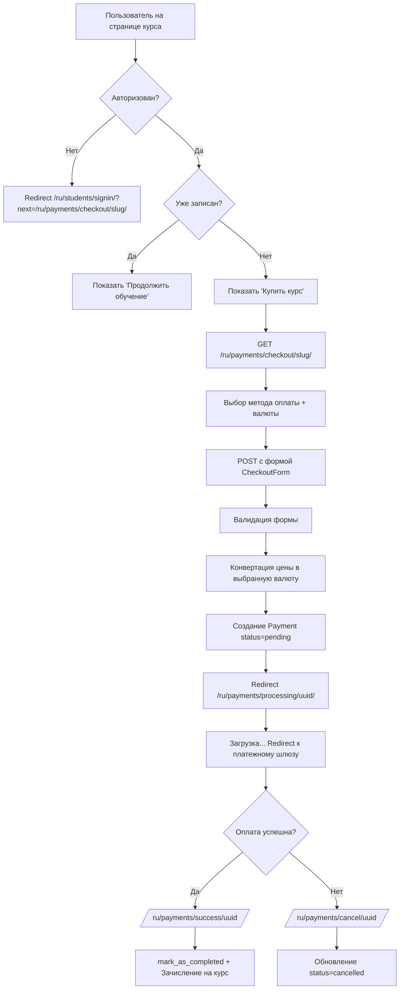

# Payments App - Система оплаты курсов

## Обзор

Приложение `payments` обеспечивает полный функционал оплаты курсов на платформе Pyland с поддержкой двух платёжных систем для Грузии: **BOG** и **TBC**.

## Архитектура

### Модели

#### Payment
Основная модель для хранения информации о платежах.

**Поля:**
- `id` (UUID) - Уникальный идентификатор платежа
- `user` (FK) - Пользователь, совершивший оплату (authentication.User)
- `course` (FK) - Оплаченный курс (courses.Course)
- `amount` (Decimal) - Сумма платежа (до 10 знаков, 2 после запятой)
- `currency` (CharField) - Валюта: USD, GEL, RUB
- `payment_method` (CharField) - Метод оплаты: bog, tbc
- `status` (CharField) - Статус: pending, processing, completed, failed, cancelled, refunded
- `transaction_id` (CharField) - ID транзакции из платёжной системы (nullable)
- `payment_url` (URLField) - URL для редиректа на оплату (nullable)
- `extra_data` (JSON) - Дополнительные данные от платёжных систем
- `created_at` (DateTime) - Дата создания
- `updated_at` (DateTime) - Дата обновления

**Методы:**
- `mark_as_completed()` - Завершить платёж и записать студента на курс через `course.student_enrollments.add(user.student)`
- `mark_as_failed()` - Пометить платёж как неудавшийся
- `is_successful()` - Проверка успешности платежа (status == 'completed')
- `can_be_refunded()` - Можно ли вернуть средства (completed и не старше 14 дней)

### Статусы платежей
- **pending** - Ожидает обработки
- **processing** - В процессе обработки
- **completed** - Успешно завершён (студент записан на курс)
- **failed** - Ошибка платежа
- **cancelled** - Отменён пользователем
- **refunded** - Возврат средств

### Методы оплаты
- **bog** - BOG - поддерживает USD, GEL, RUB
- **tbc** - TBC - поддерживает USD, GEL, RUB

### Формы

#### CheckoutForm
Форма для оформления заказа на странице checkout.

**Поля:**
- `payment_method` (RadioSelect) - Выбор метода оплаты
- `currency` (Select) - Выбор валюты
- `terms_accepted` (BooleanField) - Согласие с условиями использования
- `privacy_accepted` (BooleanField) - Согласие с политикой конфиденциальности

**Валидация:**
- Оба метода оплаты поддерживают все валюты (USD, GEL, RUB)

### Views

#### checkout_view
Главная страница оформления заказа.

**URL:** `/ru/payments/checkout/<course_slug>/`
**Метод:** GET, POST
**Доступ:** `@login_required`
**Логика:**
1. Получает курс через `course_slug` (проверяет status__in=["active", "published"])
2. Проверяет, не записан ли уже студент через `course.student_enrollments.filter(user=request.user).exists()`
3. GET: Отображает форму выбора метода оплаты и валюты
4. POST: Валидирует форму, конвертирует цену курса в выбранную валюту
5. Создаёт Payment с статусом `pending`
6. Редиректит на `payments:processing` с payment_id

**Конвертация валюты:**
```python
EXCHANGE_RATES = {
    'USD': 1.0,   # Базовая валюта
    'GEL': 2.8,   # 1 USD = 2.8 GEL
    'RUB': 95.0,  # 1 USD = 95 RUB
}
```

#### payment_success_view
**URL:** `/ru/payments/success/<payment_id>/`
**Метод:** GET
**Логика:**
1. Находит Payment по UUID
2. Вызывает `payment.mark_as_completed()` (обновляет status, записывает на курс)
3. Показывает страницу успеха с кнопкой "Начать обучение"

#### payment_cancel_view
**URL:** `/ru/payments/cancel/<payment_id>/`
**Метод:** GET
**Логика:**
1. Находит Payment по UUID
2. Обновляет status на 'cancelled'
3. Показывает страницу отмены с кнопкой "Попробовать снова"

## Курсовые ставки

```python
EXCHANGE_RATES = {
    'USD': 1.0,      # Базовая валюта
    'GEL': 2.8,      # 1 USD = 2.8 GEL
    'RUB': 95.0,     # 1 USD = 95 RUB
}
```

## URL Patterns

```python
# payments/urls.py
path('checkout/<slug:course_slug>/', checkout_view, name='checkout')
path('success/<uuid:payment_id>/', payment_success_view, name='success')
path('cancel/<uuid:payment_id>/', payment_cancel_view, name='cancel')
path('processing/<uuid:payment_id>/', payment_processing_view, name='processing')

# Webhooks (TODO - будущие интеграции):
# path('webhook/bog/', bog_webhook, name='bog_webhook')
# path('webhook/tbc/', tbc_webhook, name='tbc_webhook')
```

**Использование в шаблонах:**
```django


```

## Workflow оплаты



**Пошаговый процесс:**
1. Пользователь → Страница курса → "💳 Купить курс"
2. Проверка авторизации → Если нет: redirect на signin
3. Проверка зачисления → Если уже записан: показать "Продолжить"
4. Redirect → `/ru/payments/checkout/<slug>/`
5. Заполнение формы: метод (BOG/TBC) + валюта (USD/GEL/RUB) + согласия
6. Submit → Валидация формы
7. Конвертация цены курса через EXCHANGE_RATES
8. Создание Payment (status=pending)
9. Redirect → `/ru/payments/processing/<uuid>/` (страница загрузки)
10. JavaScript redirect → Платёжный шлюз (BOG / TBC)
11. После оплаты:
    - Success → `/ru/payments/success/<uuid>/` → `mark_as_completed()` → Зачисление через `student_enrollments.add()`
    - Cancel → `/ru/payments/cancel/<uuid>/` → `status='cancelled'`

## Безопасность

- ✅ Все views защищены `@login_required`
- ✅ UUID для платежей (не подбираемые ID)
- ✅ Валидация формы оплаты
- ✅ Проверка существования курса (404 если не найден)
- ✅ Проверка на повторную запись: `course.student_enrollments.filter(user=request.user).exists()`
- ✅ CSRF protection (Django формы)
- ✅ Только чтение в админке (has_add_permission=False, has_change_permission=False)
- ✅ Readonly fields в админке для критичных данных
- ✅ Colored status badges в админке для визуального контроля
- ⚠️ TODO: Webhook signature verification для BOG/TBC
- ⚠️ TODO: Rate limiting для payment endpoints

## Admin панель

**Реализованный функционал:**
- ✅ Просмотр всех платежей с красивым форматированием
- ✅ Цветные индикаторы статусов с emoji:
  - 🟡 pending - Жёлтый
  - 🔵 processing - Синий
  - 🟢 completed - Зелёный
  - 🔴 failed - Красный
  - ⚫ cancelled - Серый
  - 🟣 refunded - Фиолетовый
- ✅ Форматированные суммы с символами валют ($, ₾, ₽)
- ✅ Иконки методов оплаты (🏦 BOG, 💳 TBC)
- ✅ Ссылки на пользователя и курс в админке
- ✅ Фильтры: status, payment_method, currency, created_at
- ✅ Поиск: transaction_id, user email, course name
- ✅ Только чтение (защита от случайных изменений)
- ✅ Действие "Вернуть средства" (mark_as_refunded)
- ✅ Readonly поля: id, transaction_id, created_at, updated_at

**Доступ:**
`/admin/payments/payment/` - список всех платежей

## Frontend интеграция

### Шаблоны
- **checkout.html** - Страница оформления заказа (470+ строк CSS)
  - Grid layout: информация о курсе (слева) + форма оплаты (справа)
  - Кастомные radio buttons для методов оплаты
  - Dropdown для выбора валюты
  - Чекбоксы согласия с условиями и политикой
  - Респонсивный дизайн: 1024px → single column, 640px → mobile

- **payment_processing.html** - Страница загрузки с анимацией spinner
  - Показывает детали платежа
  - Автоматический redirect к платежному шлюзу (TODO)

- **payment_success.html** - Страница успешной оплаты
  - Зеленая галочка ✓
  - Информация о зачислении на курс
  - Кнопка "🚀 Начать обучение" → redirect к курсу

- **payment_cancel.html** - Страница отмены
  - Оранжевый восклицательный знак ⚠️
  - Кнопка "Попробовать снова" → возврат к checkout
  - Кнопка "Вернуться к курсам"

### Статические файлы

**CSS:** `/static/css/payments/checkout.css` (~470 линий)
- Grid и Flexbox layouts
- Custom form controls
- Анимации (@keyframes spin)
- Media queries для адаптивности
- Цветовые схемы для статусов

**JavaScript:** `/static/js/payments/checkout.js`
- Динамическое обновление цены при смене валюты
- Валидация формы оплаты
- LocalStorage для сохранения предпочтений валюты
- Блокировка повторной отправки формы
- Автообновление converted price в UI

### Интеграция в course_detail.html

Кнопка покупки добавлена в шаблон страницы курса:

```django

    
        <a href="" class="btn btn-success">
            🚀 Продолжить обучение
        </a>
    
        <a href="" class="btn btn-primary">
            💳 Купить курс
        </a>
    

    <a href="?next=" class="btn btn-warning">
        🔐 Войти и купить
    </a>

```

## Связанные модели

### Course.student_enrollments
**ВАЖНО:** Используется `student_enrollments` (НЕ `students`!)

```python
# courses/models.py
class Course(models.Model):
    # ... other fields
    students = models.ManyToManyField(
        'authentication.Student',
        related_name='student_enrollments',  # ← Используем это!
        verbose_name='Студенты'
    )
```

**Правильное использование:**
```python
# ✅ Правильно
course.student_enrollments.add(student)
course.student_enrollments.filter(user=user).exists()

# ❌ Неправильно
course.students.add(student)  # AttributeError!
```

### Student Profile
Из `authentication/models.py`:
```python
student = request.user.student  # OneToOne relationship
course.student_enrollments.add(student)
```

### Инициация платежа
```
POST   /api/payments/initiate
{
  "course_id": "uuid",
  "payment_method": "card"
}
```

### Проверка статуса
```
GET    /api/payments/{id}
```

### Webhook для шлюзов
```
POST   /api/payments/webhook
```

### История платежей
```
GET    /api/payments/history
```

### Возврат средств
```
POST   /api/payments/{id}/refund
```

## Views

### purchase_view
Страница покупки курса:
- GET: показывает форму оплаты
- POST: инициирует платеж
- Требует авторизации

## Процесс оплаты

### 1. Инициация
```
Студент → Страница курса → Кнопка "Купить" → purchase_view
```

### 2. Обработка
```
purchase_view → Payment Gateway API → Redirect к шлюзу
```

### 3. Подтверждение
```
Gateway → Webhook → Update Payment status → Enroll student
```

### 4. Зачисление
```
Payment.status = 'completed' → Добавление к Course.students
```

## Интеграция с шлюзами

### Stripe (планируется)
```python
import stripe
stripe.api_key = settings.STRIPE_SECRET_KEY
intent = stripe.PaymentIntent.create(...)
```

### PayPal (планируется)
```python
from paypalrestsdk import Payment
payment = Payment({...})
```

## Безопасность

### Хранение данных
- ❌ НЕ храним данные карт
- ✅ Храним только transaction_id
- ✅ Логируем все операции
- ✅ Шифруем sensitive данные в extra_data

### Валидация webhook
```python
def verify_webhook_signature(payload, signature):
    # Проверка подписи от платежного шлюза
    ...
```

## Admin панель

Планируемый функционал:
- Просмотр всех платежей
- Фильтры по статусу, методу, дате
- Цветные индикаторы статусов
- Экспорт в CSV/Excel
- Статистика по платежам
- Только чтение (изменения через API)

## Уведомления

При изменении статуса:
- Email пользователю
- Уведомление в личном кабинете
- Webhook для внешних систем

## Тестирование

### Тестовые карты (Stripe)
```
4242 4242 4242 4242 - Success
4000 0000 0000 0002 - Decline
4000 0000 0000 9995 - Insufficient funds
```

### Запуск тестов
```bash
pytest payments/tests/ -v
```

## Мониторинг

### Метрики
- Количество успешных платежей
- Средний чек
- Конверсия оплат
- Частые ошибки

### Логирование
Все операции логируются в:
- `payments.log`
- Sentry для критических ошибок
- Admin panel для истории

## Связанные приложения

- **courses** - связь платежа с курсом
- **students** - зачисление после оплаты
- **notifications** - уведомления о статусе
- **certificates** - генерация после покупки (опционально)

## Настройки

В `settings.py`:
```python
# Payment settings
STRIPE_PUBLIC_KEY = env('STRIPE_PUBLIC_KEY')
STRIPE_SECRET_KEY = env('STRIPE_SECRET_KEY')
STRIPE_WEBHOOK_SECRET = env('STRIPE_WEBHOOK_SECRET')

PAYPAL_CLIENT_ID = env('PAYPAL_CLIENT_ID')
PAYPAL_SECRET = env('PAYPAL_SECRET')

DEFAULT_CURRENCY = 'GEL'
```

## Авторы

Pyland Team, 2025
