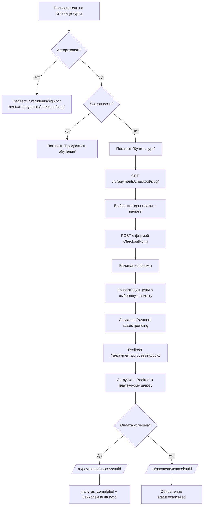

# Payments App - Payment System

## Overview

Модуль `payments` обеспечивает полный функционал оплаты курсов на платформе Pyland через **Paddle Billing** - современную платформу для приема международных платежей.

## Architecture

### Core Components

```
payments/
├── models.py           # Payment model with full lifecycle
├── paddle_service.py   # Paddle Billing API integration (Singleton pattern)
├── views.py           # Django views for checkout & payment results
├── api.py             # REST API endpoints (Django Ninja)
├── forms.py           # CheckoutForm with validation
├── schemas.py         # Pydantic schemas for API
├── constants.py       # CSP domains for Paddle.js
├── admin.py           # Django Admin with custom displays
├── urls.py            # URL routing
└── templates/payments/
    ├── checkout.html
    ├── paddle_redirect.html
    ├── payment_success.html
    └── payment_cancel.html

static/
├── css/payments/
│   ├── checkout.css
│   └── paddle_checkout.css
└── js/payments/
    ├── checkout.js
    └── paddle_checkout.js
```

## Models

### Payment
Основная модель для хранения информации о платежах.

**Fields:**
- `id` (UUID) - Primary key
- `user` (FK → User) - Customer who purchased
- `course` (FK → Course) - Purchased course
- `amount` (Decimal[12,2]) - Payment amount
- `currency` (CharField[3]) - Currency: USD, EUR, RUB, GEL
- `payment_method` (CharField[20]) - Always "paddle"
- `status` (CharField[20]) - Payment status (see below)
- `transaction_id` (CharField[255]) - Paddle transaction ID
- `payment_url` (URLField) - Checkout URL
- `payment_date` (DateTime) - Completion timestamp
- `extra_data` (JSONField) - Paddle API responses
- `created_at` (DateTime) - Creation timestamp
- `updated_at` (DateTime) - Last update timestamp

**Custom Indexes:**
- `(user, -created_at)` - User payment history
- `(status, -created_at)` - Status filtering
- `(transaction_id)` - Paddle transaction lookup

**Methods:**
- `mark_as_completed()` - Complete payment and enroll student to course
- `mark_as_failed(error_message)` - Mark payment as failed with error details
- `is_successful()` - Check if payment completed
- `can_be_refunded()` - Check if refund is possible
- `get_payment_method_display_name()` - Returns "Paddle Billing"

### Payment Statuses

| Status | Description | Auto-transitions |
|--------|-------------|------------------|
| `pending` | Payment created, awaiting processing | → processing |
| `processing` | Paddle transaction created | → completed/failed |
| `completed` | ✅ Payment successful, student enrolled | Final state |
| `failed` | ❌ Payment error occurred | Final state |
| `cancelled` | User cancelled checkout | Final state |
| `refunded` | Money returned to customer | Final state |

### Supported Currencies

| Code | Symbol | Description |
|------|--------|-------------|
| USD | $ | Доллар США (базовая валюта) |
| EUR | € | Евро |
| RUB | ₽ | Российский рубль |
| GEL | ₾ | Грузинский лари |

**⚡ Dynamic Exchange Rates:**
- Курсы валют обновляются **автоматически каждый час** из exchangerate-api.com
- Кэшируются в Redis/dummy cache для быстрого доступа
- При недоступности API используются fallback статичные курсы
- Thread-safe singleton pattern для CurrencyService
- Management command: `python manage.py update_currency_rates`

**Environment Variables:**
```env
EXCHANGE_RATE_API_KEY=your_api_key_here  # Опционально, без него используются статичные курсы
```

**Получить бесплатный API ключ:** https://www.exchangerate-api.com/ (1500 запросов/месяц)

## Currency Service

### CurrencyService (Singleton)

Сервис для получения актуальных курсов валют.

**Features:**
- ✅ Автоматическое обновление каждый час через **Celery Beat**
- ✅ Кэширование в Redis (1 час TTL)
- ✅ Fallback на статичные курсы при ошибке API
- ✅ Thread-safe singleton pattern
- ✅ Логирование всех операций
- ✅ Фоновая обработка без блокировки запросов

**Key Methods:**
```python
currency_service = get_currency_service()

# Получить все курсы
rates = currency_service.get_exchange_rates(base_currency="USD")

# Конвертировать валюту
amount_eur = currency_service.convert_currency(
    amount=Decimal("100.00"),
    from_currency="USD",
    to_currency="EUR"
)

# Принудительно обновить курсы (очистить кэш)
currency_service.invalidate_cache()
```

**Автоматическое обновление (Celery Beat):**
```python
# Настроено в src/pyland/celery.py
app.conf.beat_schedule = {
    "update-currency-rates-hourly": {
        "task": "payments.update_currency_rates",
        "schedule": 3600.0,  # Каждый час
    },
}

# Задача в src/payments/tasks.py
@shared_task(name="payments.update_currency_rates")
def update_currency_rates_task():
    """Фоновое обновление курсов валют каждый час."""
    currency_service = get_currency_service()
    currency_service.invalidate_cache()
    rates = currency_service.get_exchange_rates("USD")
    logger.info(f"✅ Курсы валют автоматически обновлены через Celery")
    return rates
```

**Запуск Celery:**
```bash
# Worker (обрабатывает задачи)
poetry run celery -A pyland worker -l info

# Beat (планировщик - запускает задачи по расписанию)
poetry run celery -A pyland beat -l info

# Объединенная команда (для development)
poetry run celery -A pyland worker -B -l info
```

**Management Command (для ручной проверки):**
```bash
# Показать текущие курсы
poetry run python src/manage.py update_currency_rates --show

# Принудительно обновить курсы
poetry run python src/manage.py update_currency_rates --force
```

## Paddle Service

### PaddleService (Singleton)

Enterprise-grade service для Paddle Billing API.

**Features:**
- ✅ Singleton pattern (thread-safe)
- ✅ Environment support (sandbox/production)
- ✅ Product reuse (no duplicates)
- ✅ Custom exception hierarchy
- ✅ Structured logging
- ✅ Type hints (int | UUID support)

**Key Methods:**

#### create_transaction()
```python
paddle_service.create_transaction(
    course_id=course.id,           # int or UUID
    course_name=course.title,
    amount=Decimal("150.00"),
    currency="USD",
    user_email=user.email,
    user_id=user.id,
    success_url="/payments/success/",
    cancel_url="/payments/cancel/"
) -> dict[str, Any]
```

**Returns:**
```python
{
    "transaction_id": "txn_...",
    "customer_id": "ctm_...",
    "product_id": "pro_...",
    "price_id": "pri_...",
    "client_token": "test_...",
    "checkout_url": "https://...",
    "status": "ready",
    "amount": "150.00",
    "currency": "USD"
}
```

## Forms

### CheckoutForm

**Fields:**
- `payment_method` (HiddenInput) - Always "paddle"
- `currency` (Select) - USD/EUR/RUB choice
- `terms_accepted` (CheckboxInput) - Required
- `privacy_accepted` (CheckboxInput) - Required

**Validation:**
- All fields required
- Currency must be in CURRENCY_CHOICES
- Both agreements must be accepted

## Views

### checkout_view
Main checkout page.

**URL:** `/<lang>/payments/checkout/<slug:course_slug>/`
**Methods:** GET, POST
**Auth:** `@login_required`

**Flow:**
1. GET course by slug
2. Check if student already enrolled
3. Display form with course price and currency selector
4. POST: Create Payment (status="pending")
5. Call `paddle_service.create_transaction()`
6. Update Payment with transaction_id
7. Render `paddle_redirect.html` with client_token

### payment_success_view
**URL:** `/<lang>/payments/success/<uuid:payment_id>/`
**Auth:** `@login_required`

**Actions:**
- Find Payment by UUID
- In sandbox: auto-call `mark_as_completed()`
- In production: wait for webhook
- Display success page with "Start Learning" button

### payment_cancel_view
**URL:** `/<lang>/payments/cancel/<uuid:payment_id>/`
**Auth:** `@login_required`

**Actions:**
- Find Payment by UUID
- Update status to "cancelled"
- Display cancel page with "Try Again" button

## REST API

### Endpoints (Django Ninja)

**Public:**
- `GET /api/payments/ping` - Health check

**Authenticated:**
- `POST /api/payments/paddle/checkout` - Create checkout session
- `GET /api/payments/history` - Payment history with pagination
- `GET /api/payments/{id}` - Get payment status
- `GET /api/payments/verify/{id}` - Verify with Paddle API

**Webhooks:**
- `POST /api/payments/paddle/webhook` - Paddle webhook handler

### 🔍 API Endpoints Explained

#### 1. `GET /api/payments/{payment_id}` - Quick Status Check
**Purpose:** Быстрая проверка статуса из локальной БД
**Speed:** ⚡ Мгновенно (чтение из БД)
**Auth:** JWT required
**When to use:**
- Отображение в UI (списки, история платежей)
- Polling статуса после оплаты
- Dashboard компоненты
- Когда нужен быстрый ответ

**When NOT to use:**
- Если webhook не настроен (статус может быть устаревшим)
- Сразу после оплаты (webhook еще не пришел)

**Example:**
```bash
curl -X GET "https://api.pyland.com/api/payments/{payment_id}" \
  -H "Authorization: Bearer {jwt_token}"
```

**Response:**
```json
{
  "id": "123e4567-e89b-12d3-a456-426614174000",
  "status": "completed",
  "transaction_id": "txn_01h2xyz",
  "payment_date": "2026-03-27T14:30:00Z"
}
```

---

#### 2. `GET /api/payments/verify/{payment_id}` - Force Sync with Paddle
**Purpose:** Принудительная синхронизация с Paddle API
**Speed:** 🐢 Медленно (запрос к Paddle API, ~500-2000ms)
**Auth:** JWT required
**When to use:**
- После оплаты для проверки результата
- Отладка проблем с платежами
- Manual reconciliation (сверка)
- Когда webhook не сработал

**When NOT to use:**
- Для частых проверок (rate limits Paddle API)
- В циклах или batch операциях
- Для отображения в UI

**Example:**
```bash
curl -X GET "https://api.pyland.com/api/payments/verify/{payment_id}" \
  -H "Authorization: Bearer {jwt_token}"
```

**Workflow:**
1. Запрос к Paddle API: `GET /transactions/{transaction_id}`
2. Сравнение с локальным статусом
3. Обновление БД если отличается
4. Возврат актуального статуса

---

#### 3. `POST /api/payments/paddle/webhook` - Automatic Status Updates (RECOMMENDED)
**Purpose:** 🎯 Автоматическое обновление статусов (основной способ)
**Called by:** Paddle servers (not by users)
**Speed:** Асинхронно (не блокирует пользователя)
**Auth:** Paddle signature verification (NO JWT)

**How it works:**
1. Пользователь оплачивает → Paddle обрабатывает
2. Paddle отправляет webhook → `/api/payments/paddle/webhook`
3. Signature проверяется (защита от подделки)
4. Статус обновляется в БД
5. Пользователь видит обновленный статус через GET

**Events handled:**
- `transaction.completed` → payment.mark_as_completed()
- `transaction.payment_failed` → payment.mark_as_failed()

**Setup in Paddle Dashboard:**
1. Settings → Webhooks → Add endpoint
2. URL: `https://yoursite.com/api/payments/paddle/webhook`
3. Events: Select `transaction.completed`, `transaction.payment_failed`
4. Copy webhook secret → Add to `.env` as `PADDLE_WEBHOOK_SECRET`

**Example webhook payload:**
```json
{
  "event_type": "transaction.completed",
  "event_id": "evt_01h2xyz",
  "occurred_at": "2026-03-27T14:30:00Z",
  "data": {
    "id": "txn_01h2xyz",
    "status": "completed",
    "customer_id": "ctm_01h2abc"
  }
}
```

---

### Таблица сравнения

| Feature | GET /{id} | GET /verify/{id} | POST /webhook | Celery Task |
|---------|-----------|------------------|---------------|-------------|
| **Speed** | Fast | Slow | Async | Async |
| **Data Source** | Local DB | Paddle API | Paddle Push | Paddle API |
| **Auth** | JWT | JWT | Signature | Internal |
| **Use Case** | UI Display | Manual Debug | Auto Update | Auto Recovery |
| **Rate Limits** | None | Paddle API | None | Batch Safe |
| **Frequency** | Unlimited | Rare | Per Event | Every 30min |
| **Recommended** | For UI | Admin Only | Primary | Automation |

### Автоматическое восстановление платежей (Celery Task)

**Проблема:** Что если webhook не дошел?
**Решение:** Автоматическая проверка каждые 30 минут через Celery Beat

#### Celery Task: `check_pending_payments`

**Расположение:** `src/payments/tasks.py`

**Что делает:**
1. Находит Payment со status='processing' старше 30 минут
2. Для каждого делает запрос к Paddle API
3. Обновляет статус если изменился в Paddle
4. Логирует все расхождения

**Когда запускается:**
- Автоматически каждые 30 минут (Celery Beat)
- Или вручную: `check_pending_payments_task.delay()`

**Конфигурация в `celery.py`:**
```python
app.conf.beat_schedule = {
    "check-pending-payments-every-30-minutes": {
        "task": "payments.check_pending_payments",
        "schedule": 1800.0,  # 30 минут
    },
}
```

**Ручной запуск (для тестирования):**
```bash
# Django shell
>>> from payments.tasks import check_pending_payments_task
>>> result = check_pending_payments_task.delay()
>>> result.get()
{"checked": 5, "updated": 2, "errors": 0}
```

**Почему это лучше чем /verify endpoint:**
- Не требует ручного вмешательства
- Проверяет ВСЕ зависшие платежи, а не один
- Batch-safe (не упирается в rate limits)
- Логирует аномалии для мониторинга
- Работает даже если frontend/admin забыл проверить

**Результат:** `/verify` endpoint почти никогда не нужен!

---

### Когда использовать каждый подход

#### Нормальный процесс пользователя (99% случаев)
```
User pays
    ↓
Paddle processes (~2-5 seconds)
    ↓
Webhook arrives (instant) ← PRIMARY
    ↓
DB updated automatically
    ↓
User sees status via GET /api/payments/{id} ← FAST UI
```

#### Webhook не дошел (автоматическое восстановление)
```
Webhook lost (network issue)
    ↓
Payment stuck in 'processing'
    ↓
Wait 30 minutes...
    ↓
Celery task runs ← AUTOMATIC
    ↓
Checks Paddle API
    ↓
Updates DB
    ↓
User sees correct status
```

#### Admin/Support (редкие случаи)
```
Customer calls support
    ↓
Support checks payment
    ↓
Still showing 'processing' after 30 min
    ↓
Support calls GET /verify/{id} ← MANUAL DEBUG
    ↓
Immediate sync with Paddle
    ↓
Issue logged for investigation
```

### Когда НЕ использовать /verify

**НЕ использовать для:**
- Regular user UI (too slow, use GET /{id})
- Frequent polling (rate limits, use webhook)
- Batch operations (use Celery task)
- Monitoring (use Celery task + metrics)

**Использовать для:**
- Admin debugging specific payment
- Customer support emergency
- Development/testing manual checks
- One-off reconciliation

**Лучшие альтернативы:**
1. **Для пользователей:** GET /api/payments/{id} (fast, cached)
2. **Для автоматизации:** Celery task (batch-safe, scheduled)
3. **Для real-time:** Webhook (instant, reliable)

---

### Рекомендуемый процесс

**Нормальный процесс (с webhook):**
```
User pays → Paddle processes → Webhook updates DB → User sees status via GET
```

**Запасной процесс (webhook не сработал):**
```
User pays → Wait 5 sec → Call /verify → DB updated → User sees status
```

**Polling pattern (if webhook not available):**
```javascript
// Frontend polling
const checkPaymentStatus = async (paymentId) => {
  // Try GET first (fast)
  let status = await fetch(`/api/payments/${paymentId}`);

  // If still processing after 10 seconds, verify with Paddle
  if (status.status === 'processing' && elapsed > 10000) {
    status = await fetch(`/api/payments/verify/${paymentId}`);
  }

  return status;
}
```


## Frontend Integration

### Paddle.js Overlay

**Template:** `paddle_redirect.html`
```html
<div data-transaction-id="{{ transaction_id }}"
     data-client-token="{{ client_token }}"
     data-paddle-env="{{ paddle_env }}"
     data-success-url="{{ success_url }}"
     data-cancel-url="{{ cancel_url }}">
```

**Script:** `paddle_checkout.js`
- IIFE pattern
- Loads Paddle.js v2 from CDN
- Opens checkout overlay
- Handles events: completed → success, closed → cancel

## Security

### CSP Headers
Centralized in `constants.py`:
- `script-src`: cdn.paddle.com, sandbox-cdn.paddle.com
- `connect-src`: api.paddle.com, sandbox-api.paddle.com
- `frame-src`: checkout.paddle.com, buy.paddle.com
- `style-src`: cdn.paddle.com

Applied via `students.middleware.StudentsSecurityHeadersMiddleware`

## Configuration

### Environment Variables
```bash
# .env
PADDLE_SANDBOX_API_KEY=pdl_sdbx_apikey_...
PADDLE_API_KEY=pdl_live_apikey_...  # Production only
PADDLE_ENVIRONMENT=sandbox  # or 'production'
```

### Django Settings
```python
# settings.py
PADDLE_SANDBOX_API_KEY = os.getenv("PADDLE_SANDBOX_API_KEY")
PADDLE_API_KEY = os.getenv("PADDLE_API_KEY")
PADDLE_ENVIRONMENT = os.getenv("PADDLE_ENVIRONMENT", "sandbox")
```

## Testing

### Test Cards (Sandbox)
```
Success: 4242 4242 4242 4242
Decline: 4000 0000 0000 0002
3D Secure: 4000 0027 6000 3184
```

### Manual Test Flow
1. Login as student
2. Go to course page
3. Click "Buy Course"
4. Select currency
5. Click "Pay" → Paddle overlay opens
6. Enter test card: 4242 4242 4242 4242
7. Submit → redirected to success page
8. Verify course appears in dashboard

## Best Practices

### ✅ DO
- Use `paddle_service.create_transaction()` for all payments
- Check `course.student_enrollments.filter(id=student.id).exists()` before checkout
- Log all Paddle operations with structured logging
- Store Paddle responses in `extra_data` JSON field
- Use UUID for payment IDs (not sequential integers)

### ❌ DON'T
- Don't create products manually - use `_get_or_create_product()`
- Don't store API keys in code - use environment variables
- Don't skip webhook signature verification
- Don't trust client-side payment status - verify via webhook

## Documentation

Full technical docs:
- `docs/payments/README.md` - Overview
- `docs/payments/PADDLE_INTEGRATION.md` - Technical deep dive
- `docs/payments/PADDLE_TESTING.md` - Testing guide

## Admin Panel

Custom admin displays:
- 🎨 Color-coded status badges
- 🌊 Paddle icon for payment method
- 💰 Formatted amounts with currency symbols
- 🔗 Links to user and course
- 📊 Filters: status, currency, date
- 🔍 Search: transaction_id, email, course name
- 🚫 Read-only (changes via API only)

## Future Enhancements

- [ ] Webhook signature verification
- [ ] Subscription support
- [ ] Multiple courses in one transaction
- [ ] Paddle Retain integration
- [ ] Automated refund processing
- [ ] Analytics dashboard
- [ ] Unit & integration tests

## Курсовые ставки

```python
EXCHANGE_RATES = {
    'USD': 1.0,      # Базовая валюта
    'GEL': 2.8,      # 1 USD = 2.8 GEL
    'RUB': 95.0,     # 1 USD = 95 RUB
}
```

## URL Patterns

```python
# payments/urls.py
path('checkout/<slug:course_slug>/', checkout_view, name='checkout')
path('success/<uuid:payment_id>/', payment_success_view, name='success')
path('cancel/<uuid:payment_id>/', payment_cancel_view, name='cancel')
path('processing/<uuid:payment_id>/', payment_processing_view, name='processing')

# API Webhook для Paddle (обрабатывается в api.py):
# POST /api/payments/paddle/webhook
```

**Использование в шаблонах:**
```django


```

## Workflow оплаты


```mermaid
graph TD
    A[Пользователь на странице курса] --> B{Авторизован?}
    B -->|Нет| C[Redirect /ru/students/signin/?next=/ru/payments/checkout/slug/]
    B -->|Да| D{Уже записан?}
    D -->|Да| E[Показать 'Продолжить обучение']
    D -->|Нет| F[Показать 'Купить курс']
    F --> G[GET /ru/payments/checkout/slug/]
    G --> H[Выбор метода оплаты + валюты]
    H --> I[POST с формой CheckoutForm]
    I --> J[Валидация формы]
    J --> K[Конвертация цены в выбранную валюту]
    K --> L[Создание Payment status=pending]
    L --> M[Redirect /ru/payments/processing/uuid/]
    M --> N[Загрузка... Redirect к платежному шлюзу]
    N --> O{Оплата успешна?}
    O -->|Да| P[/ru/payments/success/uuid/]
    O -->|Нет| Q[/ru/payments/cancel/uuid/]
    P --> R[mark_as_completed + Зачисление на курс]
    Q --> S[Обновление status=cancelled]
```

**Пошаговый процесс:**
1. Пользователь → Страница курса → "💳 Купить курс"
2. Проверка авторизации → Если нет: redirect на signin
3. Проверка зачисления → Если уже записан: показать "Продолжить"
4. Redirect → `/ru/payments/checkout/<slug>/`
5. Заполнение формы: валюта (USD/EUR/RUB/GEL) + согласия
6. Submit → Валидация формы
7. Конвертация цены курса через EXCHANGE_RATES
8. Создание Payment (status=pending)
9. Redirect → `/ru/payments/processing/<uuid>/` (страница загрузки)
10. JavaScript/Paddle.js → Paddle Checkout overlay
11. После оплаты:
    - Success → `/ru/payments/success/<uuid>/` → `mark_as_completed()` → Зачисление через `student_enrollments.add()`
    - Cancel → `/ru/payments/cancel/<uuid>/` → `status='cancelled'`

## Безопасность

- Все views защищены `@login_required`
- UUID для платежей (не подбираемые ID)
- Валидация формы оплаты
- Проверка существования курса (404 если не найден)
- Проверка на повторную запись: `course.student_enrollments.filter(user=request.user).exists()`
- CSRF protection (Django формы)
- Только чтение в админке (has_add_permission=False, has_change_permission=False)
- Readonly fields в админке для критичных данных
- Colored status badges в админке для визуального контроля
- Webhook signature verification для Paddle (с использованием Paddle SDK Verifier)
- Rate limiting для payment endpoints (реализовано через StudentsRateLimitMiddleware)

## Admin панель

**Реализованный функционал:**
- Просмотр всех платежей с красивым форматированием
- Цветные индикаторы статусов:
  - pending - Жёлтый
  - processing - Синий
  - completed - Зелёный
  - failed - Красный
  - cancelled - Серый
  - refunded - Фиолетовый
- Форматированные суммы с символами валют ($, ₾, ₽)
- Иконка метода оплаты (Paddle Billing)
- Ссылки на пользователя и курс в админке
- Фильтры: status, payment_method, currency, created_at
- Поиск: transaction_id, user email, course name
- Только чтение (защита от случайных изменений)
- Действие "Вернуть средства" (mark_as_refunded)
- Readonly поля: id, transaction_id, created_at, updated_at

**Доступ:**
`/admin/payments/payment/` - список всех платежей

## Frontend интеграция

### Шаблоны
- **checkout.html** - Страница оформления заказа (470+ строк CSS)
  - Grid layout: информация о курсе (слева) + форма оплаты (справа)
  - Кастомные radio buttons для методов оплаты
  - Dropdown для выбора валюты
  - Чекбоксы согласия с условиями и политикой
  - Респонсивный дизайн: 1024px → single column, 640px → mobile

- **payment_processing.html** - Страница загрузки с анимацией spinner
  - Показывает детали платежа
  - Автоматический redirect к платежному шлюзу (реализовано)

- **payment_success.html** - Страница успешной оплаты
  - Зеленая галочка
  - Информация о зачислении на курс
  - Кнопка "Начать обучение" → redirect к курсу

- **payment_cancel.html** - Страница отмены
  - Оранжевый восклицательный знак
  - Кнопка "Попробовать снова" → возврат к checkout
  - Кнопка "Вернуться к курсам"

### Статические файлы

**CSS:** `/static/css/payments/checkout.css` (~470 линий)
- Grid и Flexbox layouts
- Custom form controls
- Анимации (@keyframes spin)
- Media queries для адаптивности
- Цветовые схемы для статусов

**JavaScript:** `/static/js/payments/checkout.js`
- Динамическое обновление цены при смене валюты
- Валидация формы оплаты
- LocalStorage для сохранения предпочтений валюты
- Блокировка повторной отправки формы
- Автообновление converted price в UI

### Интеграция в course_detail.html

Кнопка покупки добавлена в шаблон страницы курса:

```django

    
        <a href="" class="btn btn-success">
            🚀 Продолжить обучение
        </a>
    
        <a href="" class="btn btn-primary">
            💳 Купить курс
        </a>
    

    <a href="?next=" class="btn btn-warning">
        🔐 Войти и купить
    </a>

```

## Связанные модели

### Course.student_enrollments
**ВАЖНО:** Используется `student_enrollments` (НЕ `students`!)

```python
# courses/models.py
class Course(models.Model):
    # ... other fields
    students = models.ManyToManyField(
        'authentication.Student',
        related_name='student_enrollments',  # ← Используем это!
        verbose_name='Студенты'
    )
```

**Правильное использование:**
```python
# ✅ Правильно
course.student_enrollments.add(student)
course.student_enrollments.filter(user=user).exists()

# ❌ Неправильно
course.students.add(student)  # AttributeError!
```

### Student Profile
Из `authentication/models.py`:
```python
student = request.user.student  # OneToOne relationship
course.student_enrollments.add(student)
```

### Инициация платежа
```
POST   /api/payments/initiate
{
  "course_id": "uuid",
  "payment_method": "card"
}
```

### Проверка статуса
```
GET    /api/payments/{id}
```

### Webhook для шлюзов
```
POST   /api/payments/webhook
```

### История платежей
```
GET    /api/payments/history
```

### Возврат средств
```
POST   /api/payments/{id}/refund
```

## Views

### purchase_view
Страница покупки курса:
- GET: показывает форму оплаты
- POST: инициирует платеж
- Требует авторизации

## Процесс оплаты

### 1. Инициация
```
Студент → Страница курса → Кнопка "Купить" → purchase_view
```

### 2. Обработка
```
purchase_view → Payment Gateway API → Redirect к шлюзу
```

### 3. Подтверждение
```
Gateway → Webhook → Update Payment status → Enroll student
```

### 4. Зачисление
```
Payment.status = 'completed' → Добавление к Course.students
```

## Интеграция с шлюзами

### Stripe (планируется)
```python
import stripe
stripe.api_key = settings.STRIPE_SECRET_KEY
intent = stripe.PaymentIntent.create(...)
```

### PayPal (планируется)
```python
from paypalrestsdk import Payment
payment = Payment({...})
```

## Безопасность

### Хранение данных
- ❌ НЕ храним данные карт
- ✅ Храним только transaction_id
- ✅ Логируем все операции
- ✅ Шифруем sensitive данные в extra_data

### Валидация webhook
```python
def verify_webhook_signature(payload, signature):
    # Проверка подписи от платежного шлюза
    ...
```

## Admin панель

Планируемый функционал:
- Просмотр всех платежей
- Фильтры по статусу, методу, дате
- Цветные индикаторы статусов
- Экспорт в CSV/Excel
- Статистика по платежам
- Только чтение (изменения через API)

## Уведомления

При изменении статуса:
- Email пользователю
- Уведомление в личном кабинете
- Webhook для внешних систем

## Тестирование

### Тестовые карты (Stripe)
```
4242 4242 4242 4242 - Success
4000 0000 0000 0002 - Decline
4000 0000 0000 9995 - Insufficient funds
```

### Запуск тестов
```bash
pytest payments/tests/ -v
```

## Мониторинг

### Метрики
- Количество успешных платежей
- Средний чек
- Конверсия оплат
- Частые ошибки

### Логирование
Все операции логируются в:
- `payments.log`
- Sentry для критических ошибок
- Admin panel для истории

## Связанные приложения

- **courses** - связь платежа с курсом
- **students** - зачисление после оплаты
- **notifications** - уведомления о статусе
- **certificates** - генерация после покупки (опционально)

## Настройки

В `settings.py`:
```python
# Payment settings
STRIPE_PUBLIC_KEY = env('STRIPE_PUBLIC_KEY')
STRIPE_SECRET_KEY = env('STRIPE_SECRET_KEY')
STRIPE_WEBHOOK_SECRET = env('STRIPE_WEBHOOK_SECRET')

PAYPAL_CLIENT_ID = env('PAYPAL_CLIENT_ID')
PAYPAL_SECRET = env('PAYPAL_SECRET')

DEFAULT_CURRENCY = 'GEL'
```

## Авторы

Pyland Team, 2025
